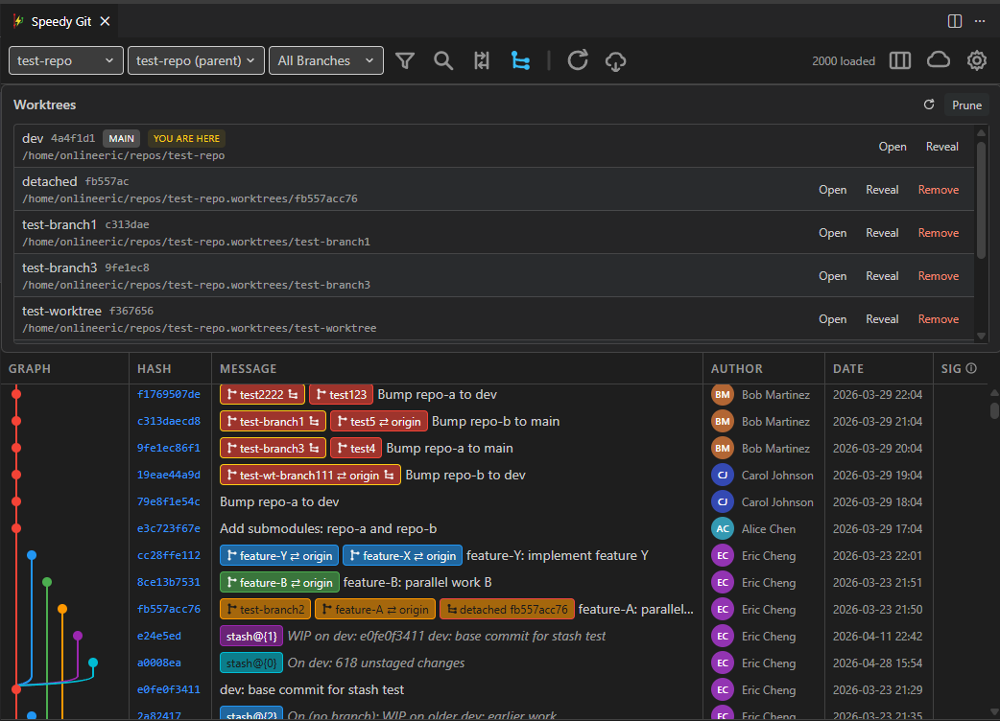
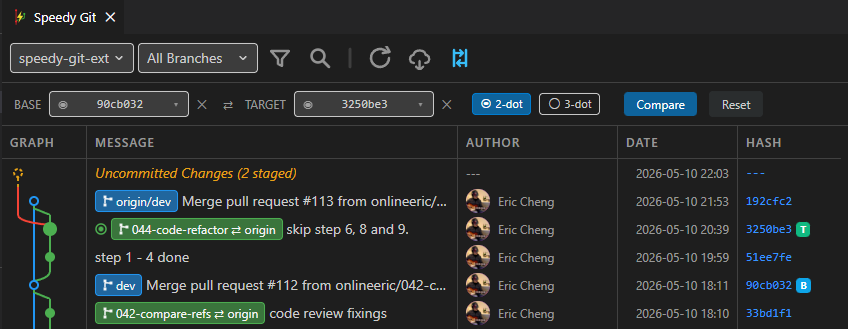
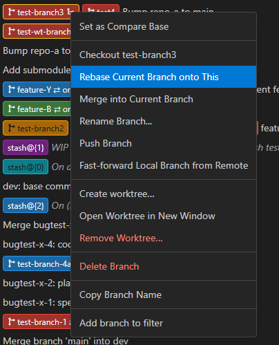

# Speedy Git — Fast Git Graph & History UI for VS Code and Cursor

A performance-first Git graph, history viewer, history-editing tool, and worktrees manager built for developers who want speed, clarity, and real Git workflow power — without the bloat.

**Speedy Git** renders large repositories instantly with virtual scrolling and batch prefetch, so you can browse thousands of commits, review diffs, and run Git operations — all from one clean panel inside VS Code or Cursor.

> If you've been looking for a **fast git graph**, a **lightweight git history viewer**, or a **practical rebase and cherry-pick UI** that doesn't slow you down — Speedy Git is built for exactly that.

## Why Speedy Git?

| What you get | How it works |
|---|---|
| **Instant graph rendering** | Virtual scrolling + batch prefetch keeps large repos responsive — no loading spinners, no lag |
| **Real Git operations** | Merge, rebase, cherry-pick, revert, reset, drop commit, push, pull, fetch — all from context menus with live command preview |
| **Compare anything to anything** | Two-click A vs B diff for any commit, branch, tag, or your working tree — with PR-style three-dot mode |
| **Search and filter** | Quickly find commits by message, hash, or author, then narrow history with branch, author, and date filters |
| **Worktrees** | Run AI coding sessions on different branches at the same time without constantly switching your main checkout |
| **Clean, scannable UI** | Color-coded branch lanes, merged local/remote labels, avatars, and clear HEAD indicators |
| **History editing workflow** | Interactive rebase with drag-and-drop reordering (pick, squash, fixup, reword, drop) |
| **Works in VS Code and Cursor** | Published on both VS Code Marketplace and Open VSX |

## What's New in v5

### Worktrees for multi-session AI coding
Create, open, reveal, and remove Git worktrees so different AI agents or editor sessions can work on different branches at the same time without switching your main checkout.

### GPG and SSH signing verification
Verify signed commits on demand with a dedicated Signature column, clear trust states, and bundled help for local signing setup.

### Compare Refs — A vs B, Anything to Anything (new in v4)

Stop dropping into the terminal to figure out what changed between two points in history. Speedy Git now ships a first-class **Compare** panel right next to Filter and Search.

- **Pick any two commit-ish references** in seconds — commit hashes, local branches, remote branches, tags, `HEAD`, your **Working Tree**, or typed expressions like `HEAD~3` and `origin/main^2`. One searchable combobox handles every input type, with recently-used items at the top.
- **Two-click compare from the graph** — right-click a commit, branch, or tag → **Set as Compare Base**, then right-click another → **Compare with Base**. The diff opens in the Commit Details panel you already use.
- **Multi-select and compare a range** — Ctrl/Cmd+click two or more commits, right-click → **Compare these commits**. Base = oldest, Target = newest, runs immediately.
- **PR-style three-dot diff by default** for branch-vs-branch and tag-vs-tag — see exactly "what Target adds since branching off Base," matching GitHub's "Files changed" tab. Smart fallback to two-dot when slots are commit hashes or when there's no common ancestor.
- **Compare your uncommitted work** against any ref — pick `Working Tree` in one slot and `HEAD`, `origin/main`, or a tag in the other. Auto-refreshes as you edit files on disk.
- **B / T badges on the graph** light up the moment you fill a slot — no waiting for a comparison to finish to see where your endpoints are.
- **Live, lazy-resolving slots** — branches and tags resolve to the current tip at Compare time, so a fetch or auto-refresh between picking and clicking is reflected in the result.
- **Cancel any in-flight compare** mid-run; swap (⇄) Base and Target with one click; **Reset** clears everything in a single action.
- **Pending-state toolbar button** turns light yellow when slots are filled but the panel is closed, so you never lose your place.

## Core Feature Summary
>Right-click menu — there are even more features in other menus and panels!  
>
>

- Fast commit graph and history browsing with virtual scrolling, color-coded branch lanes, table-style rows, resizable columns, avatars, and clear HEAD/ref labels.
- Powerful search and filtering by commit message, hash, author, branch, and date, with match navigation for large histories.
- Commit details with resizable bottom/right layout, file tree/list views, per-file stats, and inline diffs.
- Branch, tag, stash, remote, submodule, and multi-repo workflows from one panel, including fetch, pull, push, checkout, merge, and remote management.
- History editing tools for interactive rebase, cherry-pick, revert, reset, and drop commit, with conflict-aware continue/abort flows.
- Live Git command previews in major dialogs, plus personalization for graph colors, date format, ref visibility, avatars, and persisted panel layout.

## How Speedy Git Compares

| | Speedy Git | Heavy all-in-one Git extensions | Basic Git graph viewers |
|---|---|---|---|
| Large repo performance | Virtual scrolling, batch prefetch | Can lag on large histories | Often loads everything at once |
| AI-ready worktrees | Parallel branch worktrees for multi-session AI coding | Varies or requires separate tools | Rare |
| Search, filter, and compare | Built-in search, advanced filters, and A vs B compare | Usually available, often spread across views | Limited |
| History editing | Rebase, cherry-pick, revert, drop, reset — all in-panel | Varies | View-only or minimal |
| Commit signature verification | On-demand GPG and SSH verification | Varies | Rare |
| Live command preview | Every dialog shows the exact git command | Rare | No |
| UI clarity | Merged branch labels, color-coded lanes, avatars | Feature-dense, complex UI | Basic |
| Repo support | Multi-repo switching, submodule navigation, worktree visibility | Varies | Rare |
| Startup overhead | Lightweight, single-panel | Extension suite, multiple views | Lightweight |

## Quick Start

1. Install **Speedy Git** from [VS Code Marketplace](https://marketplace.visualstudio.com/items?itemName=onlineeric.speedy-git-ext) or [Open VSX](https://open-vsx.org/extension/onlineeric/speedy-git-ext).
2. Open any Git repository in VS Code or Cursor.
3. Launch Speedy Git from the Source Control panel icon, the status bar button, or press `Ctrl+Shift+G` (`Cmd+Shift+G` on Mac).

Open Speedy Git from the Source Control panel:

Open Speedy Git from the status bar:

## Telemetry

Speedy Git collects **anonymous, aggregate-only usage statistics** (feature
usage counts, standardized error codes, performance timings) to guide
development — never repository names, branch names, file paths, commit
content, or anything you type. Collection honors VS Code's global
`telemetry.telemetryLevel` **and** the extension's own
`speedyGit.telemetry.enabled` setting (default on): turning either off stops
all collection, with no restart needed. A dedicated "Speedy Git Telemetry"
output channel logs every sent event for full transparency.

See [docs/telemetry.md](docs/telemetry.md) for the complete list of what is
and is not collected and how to opt out.

## Issues, Feature Requests & Feedback

- Issues and feature requests: [GitHub Issues](https://github.com/onlineeric/speedy-git-ext/issues)
- Source code: [github.com/onlineeric/speedy-git-ext](https://github.com/onlineeric/speedy-git-ext)
- License: [MIT](LICENSE.md)
