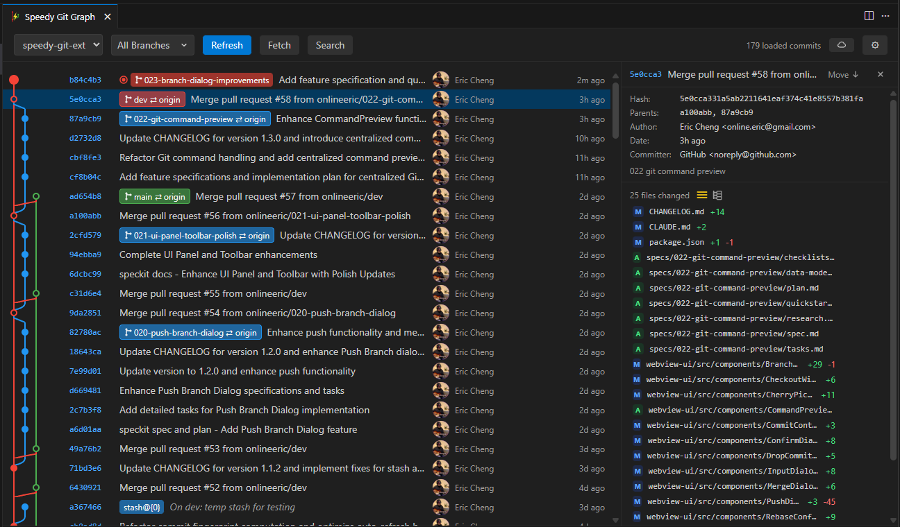
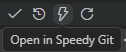

# Speedy Git Extension

Fast, practical Git history and history-editing inside VS Code and Cursor.

Speedy Git is built for performance first.  
It keeps large repositories responsive while you explore history, review commits, and run core Git operations from one panel.

## Major Features

- Blazing-fast commit graph with virtual scrolling and batch prefetch for large repositories.
- Branch, tag, and commit detail views with diff, icons, and clear HEAD/context indicators.
- Rich Git operations:
  - Create, rename, delete, and checkout branches.
  - Merge strategy controls, pull, push, fetch, and remote tracking management.
  - Reset (soft/mixed/hard), cherry-pick, rebase, revert, and commit drop.
- Powerful UI flow: quick commit search/filter, keyboard shortcuts, and in-panel repo switching.
- Submodule support with status, parent-to-submodule navigation, and update/init actions.
- Personalization: theme-like graph colors, date format, avatars, and branch/tag visibility toggles.
- Trust support: on-demand GPG/SSH signature verification in commit details.

Try it if you want a cleaner way to browse and operate on big Git histories without leaving VS Code.

## Quick start

Open Speedy Git from VSCode left panel source control view:  

Open Speedy Git from VSCode bottom status bar:  

## Requirements

- VS Code 1.80+ or Cursor IDE
- Git available in PATH
