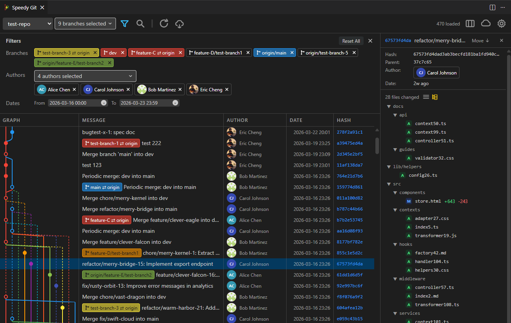
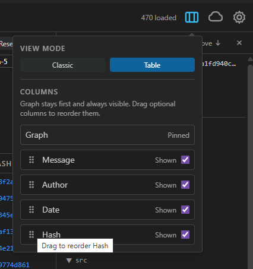

# Speedy Git — Fast Git Graph & History UI for VS Code and Cursor

A performance-first Git graph, Git history viewer, and history-editing tool built for developers who want speed, clarity, and real Git workflow power — without the bloat.

**Speedy Git** renders large repositories instantly with virtual scrolling and batch prefetch, so you can browse thousands of commits, review diffs, and run Git operations — all from one clean panel inside VS Code or Cursor.

> If you've been looking for a **fast git graph**, a **lightweight git history viewer**, or a **practical rebase and cherry-pick UI** that doesn't slow you down — Speedy Git is built for exactly that.

## Why Speedy Git?

| What you get | How it works |
|---|---|
| **Instant graph rendering** | Virtual scrolling + batch prefetch keeps large repos responsive — no loading spinners, no lag |
| **Real Git operations** | Merge, rebase, cherry-pick, revert, reset, drop commit, push, pull, fetch — all from context menus with live command preview |
| **Compare anything to anything** | Two-click A vs B diff for any commit, branch, tag, or your working tree — with PR-style three-dot mode |
| **Clean, scannable UI** | Color-coded branch lanes, merged local/remote labels, avatars, and clear HEAD indicators |
| **History editing workflow** | Interactive rebase with drag-and-drop reordering (pick, squash, fixup, reword, drop) |
| **Works in VS Code and Cursor** | Published on both VS Code Marketplace and Open VSX |

## Features

### Recent New UI and features
We have a new UI, with a new control bar and toggle panel for Filter, Search, and Compare. The commit list is now a table-style view with resizable columns, column reordering, and column visibility controls.

### Advanced Filter
In additonal to branch filter, we have a new advanced filter panel with
- Authors filter
- Date range filter

### Table View Commit List
We have a new table-style commit list view with resizable columns, column reordering, and column visibility controls.

### Compare Refs — A vs B, Anything to Anything (new in v4 pre-release)

Stop dropping into the terminal to figure out what changed between two points in history. Speedy Git now ships a first-class **Compare** panel right next to Filter and Search.

- **Pick any two commit-ish references** in seconds — commit hashes, local branches, remote branches, tags, `HEAD`, your **Working Tree**, or typed expressions like `HEAD~3` and `origin/main^2`. One searchable combobox handles every input type, with recently-used items at the top.
- **Two-click compare from the graph** — right-click a commit, branch, or tag → **Set as Compare Base**, then right-click another → **Compare with Base**. The diff opens in the Commit Details panel you already use.
- **Multi-select and compare a range** — Ctrl/Cmd+click two or more commits, right-click → **Compare these commits**. Base = oldest, Target = newest, runs immediately.
- **PR-style three-dot diff by default** for branch-vs-branch and tag-vs-tag — see exactly "what Target adds since branching off Base," matching GitHub's "Files changed" tab. Smart fallback to two-dot when slots are commit hashes or when there's no common ancestor.
- **Compare your uncommitted work** against any ref — pick `Working Tree` in one slot and `HEAD`, `origin/main`, or a tag in the other. Auto-refreshes as you edit files on disk.
- **B / T badges on the graph** light up the moment you fill a slot — no waiting for a comparison to finish to see where your endpoints are.
- **Live, lazy-resolving slots** — branches and tags resolve to the current tip at Compare time, so a fetch or auto-refresh between picking and clicking is reflected in the result.
- **Cancel any in-flight compare** mid-run; swap (⇄) Base and Target with one click; **Reset** clears everything in a single action.
- **Pending-state toolbar button** turns light yellow when slots are filled but the panel is closed, so you never lose your place.

### Git Graph & Commit History

- Fast, interactive commit graph with color-coded branch lanes and virtual scrolling for repositories of any size.
- Table-style commit list view with resizable columns, column reordering, and column visibility controls — customize which commit metadata (graph, hash, message, author, date) is shown and how wide each column appears. Double-click a column boundary to auto-fit width.
- Commit details panel (bottom or right, resizable) with file change list, per-file addition/deletion counts, and inline diff viewer. Automatically switches to side-by-side layout when the bottom panel is wide enough.
- List and tree view toggle for file changes — tree view groups by directory with automatic folder compaction.
- Hover tooltip on commit nodes showing branches, tags, stashes, worktree status, and clickable GitHub PR/issue links.
- Inline code styling for backtick-delimited text in commit messages (e.g., `functionName` renders with code background).
- Client-side search and filter by commit message, hash, or author name with match counter and auto-scroll navigation.
- Branch filter dropdown with multi-select support, real-time text search, and keyboard-first selection — view commits from multiple branches at once.

### Branch, Tag & Stash Operations

- Create, rename, delete, and checkout branches (local and remote tracking).
- Merge with strategy controls: fast-forward, no-ff, no-commit, and squash merge options.
- Tag creation (lightweight and annotated), deletion, and push to remote.
- Stash entries displayed inline in the graph with apply, pop, and drop actions.
- Smart checkout: detects conflicts, offers stash-and-checkout, handles remote tracking branches automatically.

### History Editing — Rebase, Cherry-Pick, Revert & More

- **Interactive rebase**: drag-and-drop commit reordering with pick, squash, fixup, reword, and drop actions.
- **Cherry-pick**: single or multi-commit selection with `-x` and `--no-commit` options.
- **Revert**: undo any commit (including merge commits with parent selection) without rewriting history.
- **Reset**: soft, mixed, or hard reset to any commit.
- **Drop commit**: remove non-merge commits from the current branch with conflict handling.
- Full conflict detection and resolution flow for rebase, cherry-pick, merge, and revert — with continue/abort actions.

### Live Git Command Preview

Every major dialog (merge, cherry-pick, rebase, reset, push, tag, delete, drop) shows a live preview of the exact `git` command that will run — updating in real time as you toggle options. One-click copy to clipboard for terminal use.

### Multi-Repo & Submodule Support

- In-panel repo switcher for multi-root workspaces — switch repositories without closing the panel.
- Submodule status display with parent-to-submodule navigation and "Back to parent" breadcrumb.
- Initialize and update submodules from context menu.

### Remote Operations

- Push dialog with upstream config, force-push modes (`--force-with-lease`, `--force`), and multi-remote support.
- Fetch, pull, and remote management (add, remove, edit remotes) without leaving the extension.
- Git operations automatically notify VS Code's Source Control panel to refresh, keeping it in sync immediately.

### Personalization

- Customizable graph line colors via settings (default Material Design palette, applies instantly).
- Relative or absolute date format toggle.
- GitHub and Gravatar avatars with automatic fallback to generated initials.
- Toggle remote branch labels and tag visibility.
- Commit details panel remembers its position, view mode, and size across sessions.

### Trust & Verification

- On-demand GPG and SSH commit signature verification with clear status indicators (Verified, Invalid, Unverified).

## Quick Start

1. Install **Speedy Git** from [VS Code Marketplace](https://marketplace.visualstudio.com/items?itemName=onlineeric.speedy-git-ext) or [Open VSX](https://open-vsx.org/extension/onlineeric/speedy-git-ext).
2. Open any Git repository in VS Code or Cursor.
3. Launch Speedy Git from the Source Control panel icon, the status bar button, or press `Ctrl+Shift+G` (`Cmd+Shift+G` on Mac).

Open Speedy Git from the Source Control panel:

Open Speedy Git from the status bar:

## Requirements

- VS Code 1.85+ or Cursor IDE
- Git available in PATH

## Keyboard Shortcuts

| Shortcut | Action |
|---|---|
| `Ctrl+Shift+G` / `Cmd+Shift+G` | Open Speedy Git |
| `Ctrl+F` / `Cmd+F` | Search commits |
| `Arrow keys` | Navigate commits |
| `Enter` | Open commit details |
| `Escape` | Close panel / search |
| `R` | Refresh graph |

All shortcuts are customizable in VS Code's Keyboard Shortcuts editor.

## How Speedy Git Compares

| | Speedy Git | Heavy all-in-one Git extensions | Basic Git graph viewers |
|---|---|---|---|
| Large repo performance | Virtual scrolling, batch prefetch | Can lag on large histories | Often loads everything at once |
| History editing | Rebase, cherry-pick, revert, drop, reset — all in-panel | Varies | View-only or minimal |
| Live command preview | Every dialog shows the exact git command | Rare | No |
| UI clarity | Merged branch labels, color-coded lanes, avatars | Feature-dense, complex UI | Basic |
| Submodule support | Status, navigation, init, update | Varies | Rarely |
| Startup overhead | Lightweight, single-panel | Extension suite, multiple views | Lightweight |

## Issues, feature requests & Feedback

- Issues and feature requests: [GitHub Issues](https://github.com/onlineeric/speedy-git-ext/issues)
- Source code: [github.com/onlineeric/speedy-git-ext](https://github.com/onlineeric/speedy-git-ext)
- License: [MIT](LICENSE.md)
